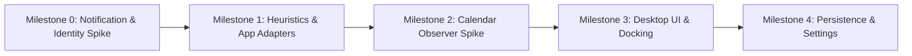

# Attention Hub — Planning Audit & Strategic Vision (Gemini Analysis)

## Status

Audit conducted on 2026-08-09 against repository state:
- Core planning docs: `docs/vision.md`, `docs/architecture.md`, `docs/milestones/milestone-0-notification-spike.md`
- Decisions: `docs/decisions/0001-*.md`, `docs/decisions/0002-*.md`
- Existing peer plan: `docs/plans/ahub-plan-claude.md`
- Codebase: React 19 + TypeScript + Vite + Tauri 2.11 scaffold under `src/` and `src-tauri/`.

---

## Executive Summary & Current State Audit

Attention Hub is in an exceptionally strong pre-implementation planning phase. The project demonstrates rare discipline for a pet project:
- **Clean Scope Boundaries**: Explicitly rejects scope creep (no cloud, no credentials, no UI embedding, no telemetry).
- **Feasibility-First Approach**: Milestone 0 is designed as a feasibility spike to validate core platform assumptions before building UI or features.
- **Decoupled Architecture**: ADR 0001 enforces an application-owned normalized snapshot boundary, isolating platform WinRT types from the React frontend.

**Current Repo State**:
- Frontend scaffold is clean and builds (`pnpm build`).
- No Rust code or Windows API integration has been written yet.
- Git repository is initialized but has no commits yet.
- Windows Rust toolchain (`rustup`, MSVC Build Tools) remains to be verified on the developer machine (Phase 0).

---

## Vision & Product Philosophy Audit

### Core Strengths
1. **The "Observer, not Container" Paradigm**:
   Hosting apps (like Teams/Outlook/Telegram) in webviews or custom frames is a maintenance nightmare (auth breakages, updates, heavy memory usage). Observing OS state preserves app independence and maintains local security/privacy.
2. **Local-First & Zero-Credential Principle**:
   Bypassing third-party APIs (Graph API, Telegram Bot API) eliminates token management, OAuth refresh flows, and cloud backend costs.

### Critical Product Challenges & Blindspots

1. **The Fundamental Mismatch: Toast Notifications ≠ "Needs Attention"**
   - **Transient & Noisy**: Apps like Teams send notifications for reactions, typing indicators, join/leave events, or secondary mentions.
   - **Auto-Dismissed / Expired**: A notification cleared by Windows Action Center does not necessarily mean the underlying message was read in Teams/Outlook.
   - **Focus Assist / Do Not Disturb (DND)**: Windows Focus Assist silences or batches toasts. When DND turns off, a burst of stale toasts may arrive, creating false urgency.
   - *Strategic Insight*: Notifications provide a *signal of activity*, not a reliable *state of unread work*. The vision must frame notifications as an initial approximation, with future milestones introducing heuristics (frequency, app rules, urgency scoring).

2. **Observer Boundary vs. User Action Gap**
   - If Attention Hub shows "3 unread items from Outlook", the user will immediately want to click an item to jump to Outlook.
   - While embedding apps is a non-goal, *launching or focusing* source windows via URI schemes (`ms-outlook://`, `tg://`) or OS window activation may become a necessary user experience bridge in later milestones without violating the observer principle.

---

## Technical Solution & Architecture Audit

### Strengths
- **ADR 0001 (Normalized Snapshot Boundary)**: Restricting native change events to *invalidation signals* (triggering a fresh snapshot fetch) eliminates complex client-side state reconciliation, out-of-order event handling, and memory leaks.
- **ADR 0002 (Package Identity as a Spike Variable)**: Recognizing early that WinRT `UserNotificationListener` requires Windows package identity prevents hitting a brick wall at installer packaging time.

### Technical Deep Dives & Hidden Implementation Risks

```text
[ Windows OS / Action Center ]
               |
    (WinRT NotificationListener)
               |
  [ Dedicated MTA Rust Thread ]  <-- Isolates COM / WinRT apartment from Tokio
               | (mpsc channel)
  [ Rust Tauri State Store ]     <-- Owns normalized NotificationSnapshot
               |
       (Tauri IPC Command)       <-- Returns typed serializable DTOs
               |
    [ React 19 Frontend ]        <-- Pure presentation & invalidation subscriber
```

1. **WinRT / COM Apartment & Tokio Async Threading Hazards**:
   - `UserNotificationListener.RequestAccessAsync()` and `NotificationChanged` COM event callbacks require specific COM apartment initialization (`CoInitializeEx` / MTA or STA).
   - Direct invocation inside Tauri command handlers (which execute on Tokio worker threads) can cause `RPC_E_WRONG_THREAD`, marshaling errors, or silent hangs.
   - *Recommendation*: Spawn a dedicated OS background thread (`std::thread`) with an explicit COM apartment state to host the `UserNotificationListener` and bridge events to Tauri via Rust crossbeam/tokio channels.

2. **Windows Package Identity (`uap3:userNotificationListener`)**:
   - Standard unpackaged Win32 binaries (`cargo run` / `tauri dev`) calling `UserNotificationListener.Current.RequestAccessAsync()` usually return `AccessStatus::Denied` or throw a manifest exception.
   - *Sparse / External Location Identity*: The most promising path for development is registering a developer manifest using PowerShell `Register-AppxPackage -Register ... -DisableDevelopmentMode` pointing to the executable directory. This must be thoroughly validated in Phase 1.

3. **Toast Payload Structural Heterogeneity**:
   - `NotificationBinding.GetTextElements()` returns an unlabelled `IReadOnlyList<AdaptiveNotificationText>`.
   - Teams, Outlook, and Telegram structure their XML toast templates differently:
     - Teams: Header = Channel/Sender, Body = Message preview.
     - Outlook: Header = Subject, Body Line 1 = Sender, Body Line 2 = Body preview.
     - Telegram: Header = Contact/Group, Body = Message text.
   - Raw string extraction (`rawTextElements`) without app-specific parser rules will result in mixed/confusing UI display.

---

## Stages & Roadmap Recommendations

### Revised Milestone Progression



#### Milestone 0: Feasibility Spike (Current Focus)
- **Goal**: Answer whether Tauri + WinRT `UserNotificationListener` is technical viable on Windows 10/11.
- **Key Exit Gate**: Achieve `AccessStatus::Allowed` and render real toast data from Teams, Outlook, and Telegram in plain React UI.

#### Milestone 1: Normalized Parsers & Noise Filter Engine
- **Goal**: Transform raw toast strings into structured, readable attention items.
- **Features**:
  - App-specific payload formatters (Teams vs. Outlook vs. Telegram).
  - Deduplication engine (grouping multiple toasts from the same chat/thread).
  - Expiry and stale-item auto-pruning heuristics.

#### Milestone 2: Calendar & Event Observer Spike
- **Goal**: Integrate time-based attention (upcoming meetings, focus blocks).
- **Features**: Local Windows Calendar API (WinRT `AppointmentStore`) or local `.ics` / Outlook process observer. Zero cloud authentication required.

#### Milestone 3: Desktop UI & Window Behavior
- **Goal**: Create a unobtrusive, persistent attention panel.
- **Features**:
  - Compact always-on-top edge dock (collapsible sidebar / overlay panel).
  - Glassmorphism / Windows Mica visual theme.
  - Global hotkeys (`Win + Shift + A`) to toggle panel visibility.
  - Source app window activation (click to focus app).

#### Milestone 4: Local Storage & User Control
- **Goal**: Add local history and user customization.
- **Features**:
  - Embedded SQLite (via `rusqlite`) for local attention logging.
  - Source filtering rules (ignore specific apps or keywords).
  - Export / wipe local data capability.

---

## Strategic Recommendations & Opinion

1. **Strictly Time-Box Milestone 0 Phase 1**:
   Do not spend weeks polishing React UI if Phase 1 package identity fails. Set a strict limit (e.g., 2–3 focused sessions) to prove whether `UserNotificationListener` can run under `tauri dev` or via a Sparse Package identity script.

2. **Document Fallback Strategy Early**:
   If `UserNotificationListener` proves unviable due to Windows MSIX signing/packaging restrictions, document the pivot plan in `vision.md`:
   - *Alternative A*: Windows UI Automation (UIA) / Taskbar badge & window title observer.
   - *Alternative B*: Pivot Attention Hub's primary focus to Calendar & Local Time-Based Attention (Milestone 2), with notifications as secondary opt-in.

3. **Incorporate Unit Testing for DTO Normalization**:
   While live WinRT notifications cannot be easily mocked in CI, the Rust mapping functions (converting raw text elements & headers into `AttentionNotification` structs) should be thoroughly unit-tested using synthetic data fixtures in `src-tauri/src/adapter/tests.rs`.

4. **Initialize Version Control Immediately**:
   Create the initial git commit before starting Phase 0. A clean git history documenting each spike phase will serve as valuable evidence for platform behaviors observed.

---

## Immediate Action Checklist for Project Owner

- [ ] **Step 1**: Run `git add .` and `git commit -m "feat: initial scaffold and planning documentation"` to baseline the project.
- [ ] **Step 2**: Verify Rust MSVC toolchain (`rustc --version`, Visual Studio 2022 Desktop C++ Workload).
- [ ] **Step 3**: Add `windows` crate dependencies to `src-tauri/Cargo.toml` with WinRT notification features.
- [ ] **Step 4**: Execute Phase 1 (Package Identity & `RequestAccessAsync` spike) and log exact WinRT error/success codes.
